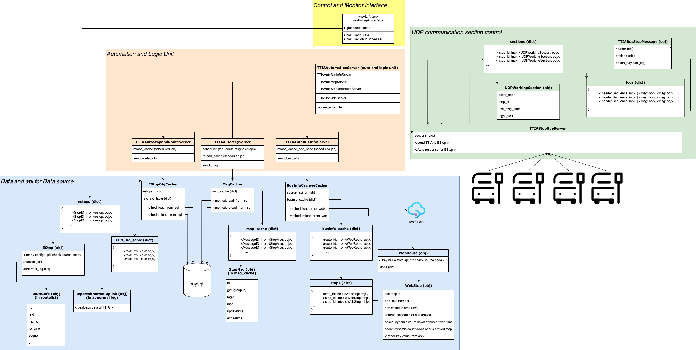

# TTIA Estop communicate center
<hr>
A Automotive server using TTIA EStop protocol, controlling the infomation that should be send to estops.

## introduction
This center is like a communication hub, bypassing the information to the related estop.

There are two service in this project; One is the UDP server, another is a HTTP server.

UDP server is using for TTIA communication between this server and EStops.

HTTP server get some restful apis for monitoring and controlling this server.

This server also requires two data sources: Mysql & bus info api.

Mysql database store a series of basic data of estops, inclouding config data, and route informations.
estops would come and ask for these data.

Bus info api support bus location information live and dynamically. 
This center will collect this information and send directly to related estop.  

## Server diagram


## installation
```
(git clone <git url>)
python3 -m venv venv
source venv/bin/activate
pip install -U pip
pip install -r requirements.txt
touch .env
(edit .env)
```

## .env
```
SQL_HOST = <ip>
SQL_PORT = <port>
SQL_USER = <user>
SQL_PW = <password>
SQL_DB = <name of database>

#  No using in this stage
MON_HOST = <ip>
MON_PORT = <port>
MON_USER = <user>
MON_PW = <password>
MON_DB = <name of database>

BUS_INFO_SOURCE = http://xxx.xxx.xxx.xxxx:xxxxx/api/v1/routes/  # api of bus info

TIMEZONE = Asia/Taipei

TTIA_HTTP_SERVER_PORT = 5000  # http api port
TTIA_UDP_SERVER_PORT = 50000  # TTIA UDP port

# if run the dummy client
SERVER_IP = localhost  # communicate center IP:Port
TTIA_HTTP_CLIENT_PORT = 5002  # dummy client http api port
TTIA_UDP_CLIENT_PORT = 50002  # dummy client TTIA UDP port


```
## Run
If you are running a server, just simply run commend in the correct environment.
```
python server_main.py
``` 

If you need to run the dummy client, also simply run commend in the correct environment.
```
python client_main.py
``` 

<hr>

# TTIA Lib introduction

## TTIA_stop_message 
Use cases:

1. Decode coming udp binary message:
```python
from lib import TTIABusStopMessage

coming_udp_binary = b'IBST\x01\x01\x00\x00\x00\x00\x00\x00\x00\x00\x00\x00\x00\x00\x7f' \
                    b'\x00\x00\x00\x00\xa4\xa4\xa4\xe5\xaf\xb8\xa6W\x00\x00\x00\x00\x00\x00\x00\x00\x00\x00\x00\x00\x00\x00\x00\x00\x00\x00\x00\x00\x00\x00\x00\x00Eng Stop\x00\x00\x00\x00\x00\x00\x00\x00\x00\x00\x00\x00\x00\x00\x00\x00\x00\x00\x00\x00\x00\x00\x00\x00\x00\x00\x00\x00\x00\x00\x00\x00\x00\x00\x00\x00\x00\x00\x00\x00\x00\x00\x00\x00\x00\x00\x00\x00\x00\x00\x00\x00\x00\x00\x00\x00\x00\x00\x00\x00\x00\x00\x00\x00\x00\x00\x00\x00\x00\x00\x00\x00\x00\x00\x00\x00\x00\x00\x00\x00\x00\x00<' \
                    b'\x00\x00\x00\x00\x00\x00\x00\x00\x00\x00\x00\x00\x00\x00\x00\x00\x00\x00\x00\x00\x00\x00\x00\x00\x00\x00\x00\x00\x00\x00\x00\x00\x00\x00\x00\x00\x00\x00\x00\x00\x00\x00\x00\x02\x00\x00\x00\x00\x00\x00\x00\x00\x00\x00\x00\x00\x00\x00\x00\x00\x00\x00\x00\x00\x00\x00\x00\x00\x00\x00\x00\x00\x00\x00\x00\x00,\x01,\x01\x01'


msg = TTIABusStopMessage(init_data=coming_udp_binary, init_type='pdu')
print(msg.to_dict())  # you can check data by printing out .to_dict()
# >> {'header': {'ProtocolID': 'IBST', 'Protoc.....
print(msg.payload.StopCName)  # or check directly by property name
# >> 中文站名
msg.payload.StopCName = "新站名"  # or update property directly
print(msg.payload.StopCName)
# >> 新站名
```
2. Create an empty msg:
```python
from lib import TTIABusStopMessage

msg = TTIABusStopMessage(init_data=0, init_type='default')
msg.payload.IMSI, msg.payload.IMEI = 'new_IMSI', 'new_IMSI'
print(msg.payload.to_dict())
# >> {'IMSI': 'new_IMSI', 'IMEI': 'new_IMSI', 'FirmwareVersion': '1.00', 'Reserved': 0}
```

3. Create an msg with dict:
```python
from lib import TTIABusStopMessage

data_dict = {"header":{...}, "payload": {...}}
# please aware with every prop's data type
msg = TTIABusStopMessage(init_data=data_dict, init_type='dict')

```

## Auto testing
Before running test, please make sure dummy client is set, and id in test case is pointed to the dummy client.

To run test, just simply run main_test.py.
it will run through test py files in lib/TTIA_stop_message/test
